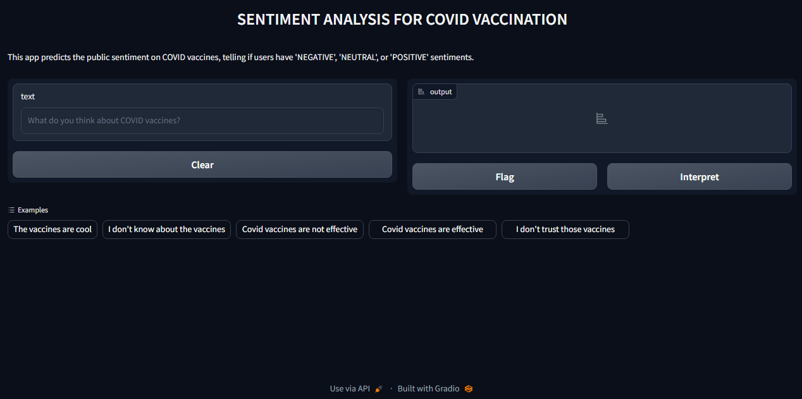

# Sentiment Analysis Using Pretrained Deep Learning Models 💡

Welcome to the **Sentiment Analysis Project** where we explore public opinions and establish the sentiment in them using pretrained, cutting-edge, deep learning models. These models will be deployed using Gradio to huggingface. Sentiment analysis is also known as opinion mining. It is the process of determining if the emotional tone or sentiment expressed in text data is positive, negative, or neutral.

## Prerequisites 📈

Ensure that you install the following libraries in your Python environment or virtual environment:

* Gradio
* Transformers
* Pytorch

## Overview 🖼

The public opinion on Covid is widely spread across neutral, positive, and negative sentiments. This project will explore the sentiments in Covid opinions by analyzing what people say via their tweets.

## Preview 🔍 🤖

Below is a preview showcasing the app's appearance.

## Key Features 💡

Here are the key features of the project:

**Deep Learning Models**: The model used was an advanced deep learning models designed for Natural Language Processing (NLP).

**Data Preparation**: The data was passed through text preprocessing, tokenization, and data splitting in preparation for fine-tuning and evaluation.

**Model Fine-tuning**: The models were fine-tuned by adjusting some of it's parameters to optimize it's performance on the dataset.

**Evaluation Metrics**: The model was evaluated using the F1_score to measure the effectiveness of the model.

**Deployment** : The fine-tuned model, along with its associated files, was deployed with Gradio. This allows the public to interact with the app and analyze sentiment in real-time with ease, and the resulting application was hosted on HuggingFace.

* [ ] [Follow this link to access the deployed app on HuggingFace](https://huggingface.co/spaces/iameberedavid/Sentiment-Analysis-On-Covid-Vaccination)

**Docker Containerization**:
Docker was used to containerize the application to streamline the deployment process and enhance scalability.

## Setup and Dependencies  🔧 🪛

To run this project, you'll need to set up a Python environment and install the required dependencies. We recommend using a virtual environment for managing project-specific packages. If you're using Google Colab, you can still set up a virtual environment for your project.

**Create a Virtual Environment:** Create a virtual environment on the project's directory.

**Installing Dependencies**
After setting up your virtual environment or if you prefer to work in your local Python environment, you can install the required dependencies from the requirements.txt file.

This will install the necessary packages, including Pandas, Datasets, Scikit-Learn, Transformers, and other libraries required for the project.

**Clone the Repository**:

Clone this repository to your local machine using the following command. Replace \<repository-url\> with the actual url to this repository:

## Author 👨‍💼

| Name                | LinkedIn                                                                                                                                                                                                                                   | Medium Article |
| ------------------------ | ------------------------------------------------------------------------------------------------------------------------------------------------------------------------------------------------------------------------------------------ | ----------- |
| Chidiebere David Ogbonna | [Chidiebere David Ogbonna](https://www.linkedin.com/in/chidieberedavidogbonna/) |[Sentiment Analysis On Covid-19 Vaccination](https://eberedavid.medium.com/sentiment-analysis-on-covid-19-vaccination-af773904e8ce)|
|                          |                                                                                                                                                                                                                                            |        |

## Resources 📚

Here are a few recommended resources to help you gain a solid understanding of the frameworks used in the project:

[Get started with Gradio](https://gradio.app/getting_started/)

[Get to know about Hugging Face](https://huggingface.co/)

[More on Docker](https://www.docker.com/)

## Acknowledgments 🙏

I would like to express my gratitude to the [Azubi Africa Data Analyst Program](https://www.azubiafrica.org/data-analytics) for their support and for offering valuable projects as part of this program. Not forgeting my scrum masters on this project [Rachel Appiah-Kubi](https://www.linkedin.com/in/racheal-appiah-kubi/) & [Emmanuel Koupoh](https://github.com/eaedk)

## License 📜

This project is licensed under the MIT License - see the [LICENSE.md](LICENSE.md) file for details.

## Contact 📧

For questions, feedback, and collaborations, please contact [Chidiebere David Ogbonna](eberedavid326@gmail.com).